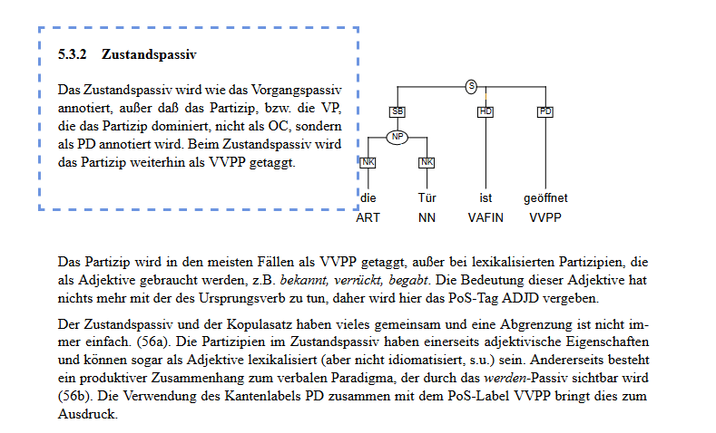

## Correction notes Jana

# Dependency Trees

Differences between uncorrected_dependency_trees.tsv and manually_corrected_dependency_trees.tsv before correction
out of the box due to different source files fed to the dependency parser

|Text_id_num |    text id  |    sent_index in text|
|------------|-------------|----------------------|
|11              |p5          |5,6       |
|9               |p3          |1,2,6     |
|8               |p2          |3         |
|7               |p1          |7         |
|4               |b4          |6         |
|3               |b3          |1,8       |
|2               |b2          |1,5       |
|1               |b1          |2         |
                                         
## Biology senetences
### b0 ID: 1
correct
### b0 ID: 2
correct
### b0 ID: 3
correct
### b0 ID: 4
correct
### b0 ID: 5
needs correction 
### b0 ID: 6
needs correction
### b0 ID: 7
correct
### b0 ID: 8
correct
### b0 ID: 9
correct

### b0 ID: 10
correct

### b1 ID: 1
correct

### b1 ID: 2
check because of differences in original file anyway
new ann seems correct
### b1 ID: 3
wrongly annotated as relative clause, should be dependend of Repl not TOchetrstrang
### b1 ID: 4
check again, with scheme
### b1 ID: 5
check again
### b1 ID: 6
correct
### b1 ID: 7
correct
### b1 ID: 8
correct
### b1 ID: 9
correct
### b1 ID: 10
correct
### b2 ID: 1
check because of differences in original file anyway, 
Wasser wrongly annotated in corrected file, 
### b2 ID: 2
heterogen ist falsch annotiert, so wei auch die beiden aufs
### b2 ID: 3
auf Mo oder OP?
### b2 ID: 4
verwzeigt als PD wäre aber im widerspruch zum adjektiv
### b2 ID: 5
check because of differences in original file anyway
Für meiner meinung nnach falsche dependency
### b2 ID: 6
correct
### b2 ID: 7
correct
### b2 ID: 8
wie sollte 'wie Phosphat' annotiert werden?, rest stimmt -> wie CM ? 
### b2 ID: 9

'und' falsche dependency,  sowie abhängiges von erhöht
### b2 ID: 10
dagegen mnr? nitrataufnahme AO nicht sb
### b3 ID: 1
check because of differences in original file anyway
würde aus abhängig von energie und nicht umwandeln machen 
### b3 ID: 2
correct
### b3 ID: 3
ganz falsch wegen gänsefüsschen
### b3 ID: 4

scheint falsch ,von denen wäre ein Phrasaler Genitiv aber er ist in einer REC deswegen bin ich nciht sicher wie ich es annotieren soll, ich glaube ich bräuchte eine sekundäre kantew
### b3 ID: 5
Consticuency tree nicht eindeutig/ möglich
### b3 ID: 6

### b3 ID: 7

### b3 ID: 8
check because of differences in original file anyway

### b3 ID: 9

### b3 ID: 10

### b3 ID: 11

### b3 ID: 12

### b4 ID: 1
zwei sb in einer phrase
in form & aus der zelle sollte mo sein 
### b4 ID: 2

### b4 ID: 3

### b4 ID: 4

### b4 ID: 5

### b4 ID: 6

### b4 ID: 7

### b4 ID: 8

### b4 ID: 9

### b4 ID: 10

### b4 ID: 11

### b4 ID: 12

### b5 ID: 1

### b5 ID: 2

### b5 ID: 3

### b5 ID: 4

### b5 ID: 5

### b5 ID: 6

### b5 ID: 7

### b5 ID: 8

### b5 ID: 9

### b5 ID: 10

### p0 ID: 1
correct

### p0 ID: 2
correct
### p0 ID: 3
correct

### p0 ID: 4
nicht korrekt mit metalischen wänden sollte kammerhälfte modifizierne 
### p0 ID: 5
nicht sicher ob re an richtiges wort bindet
### p0 ID: 6
mit wachsender bahn sollte Habkreise modifzieren 

### p1 ID: 1

### p2 ID: 1
räumlich sollte  anordnung modifizierw
### p2 ID: 2
falsche oc clause
### p2 ID: 3

### p2 ID: 4
einige falsche modifikationen 
### p2 ID: 5
correct

### p2 ID: 6
correct

### p2 ID: 7
html hat für ungeradig adv statt mein adjd und dass als mo 

### p3 ID: 1
check because of differences in original file anyway
vis seems fine
### p3 ID: 2
check because of differences in original file anyway
vis seems fine

### p3 ID: 3

rc sollte vom neutron abhänig sein
als modifikation von das nicht von sollte
ausser clause ist komisch
### p3 ID: 6
check because of differences in original file anyway

### p5 ID: 5
check because of differences in original file anyway
### p5 ID: 6
check because of differences in original file anyway

