## Correction notes Jana

## Biology senetences
### b0 ID: 1
all POS tags are correct
what about puntctuation 
Baum is not correct, changend scope of VZ clause
['(S (VP (KOUI Um) (NP (ART das) (NN Vorhandensein) (NP (ART der) (NN Polymerasekettenreaktion-Produkte))) (VZ (VVINF feststellen) (PTKZU zu) (VMINF können))) ($, ,)  (VVFIN verwendet) (PIS man) (NP (ART die) (NN Gelelektrophorese)) (PP (APPR mit) (ART einer) (ADJA anschließenden) (NN Behandlung) (NP (ART des) (NN Gels)) (PP (APPR durch) (NN Ethidiumbromid)))) ($. .)']
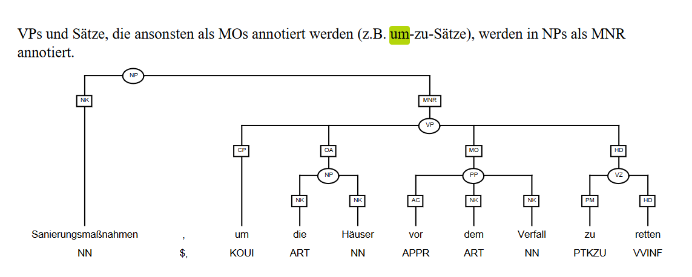
### b0 ID: 2
all POS tags are correct
baum seems to be correct
### b0 ID: 3
**darin** needs correction to PAV
was ist mit **geladen**? in  ADJA in dependency tree VVPP 
 
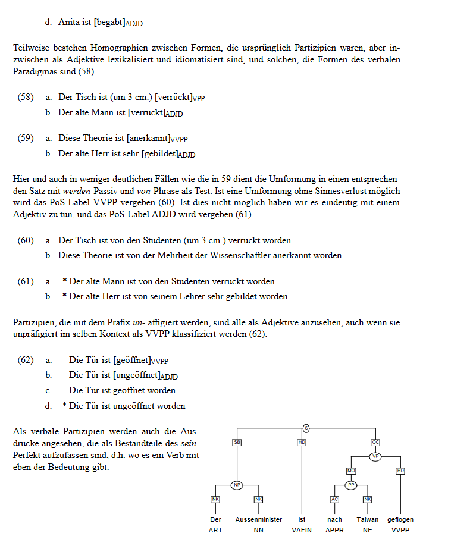

### b0 ID: 4
POS sind in ordnung aber baum sieht nicht richtig aus. 
PP clause verschoben
['(S (NP (NN Anlegen) (NP (ART eines) (ADJA elektrischen) (NN Feldes))) (VVFIN lässt) (NP (ART die) (NN Polymerasekettenreaktion-Produkte)) (PP (APPR durch) (ART ein) (ADJA gelartiges) (NN Medium) ($, ,)  (NP (ADV zumeist) (NN Agarose))) ($, ,) (VP (VVINF wandern))) ($. .)']
### b0 ID: 5
Pos , baum nicht korrekt
PP clause 
['(S (NP (ART Die) (NN DNA-Fragmente)) (VVFIN wandern) (PP (APPR durch) (ART das) ($LRB ") (NN Agarose-Sieb)) ($LRB ") (PP (PP (APPRART vom) (NN Minuspol)) (PP (APPRART zum) (NN Pluspol)))) ($. .)']
### b0 ID: 6
**daher** PAV statt PROAV
PP clause verschoben
['(CS (S (NP (ADJA Kleinere) (NN Fragmente)) (VVFIN wandern) (ADJD schneller) (PP (APPR durch) (ART das) ($LRB ") (NN Agarose-Sieb) ($LRB "))) ($, ,) (S (PROAV daher) (VVFIN befinden) (PPER sie) (PRF sich) (PP (APPR in) (ART der) (NN Nähe) (PP (APPRART zum) (NN Pluspol) (NP (ART des) (NN Gels)))))) ($. .)']
### b0 ID: 7
POS sind in ordnung, Baum nicht
['(CS (S (NP (ART Die) (ADJA größeren) (NN Fragmente)) (VVFIN wandern) (ADJD langsamer)) (KON und) (S (VVFIN bleiben) (PP (APPR in) (ART der) (NN Nähe) (PP (APPRART zum) (NN Minuspol))))) ($. .)']
### b0 ID: 8
POS sind in ordnung und baum S clause an den Anfang verschoben 
['(S (VP (KOUI Um) (NN DNA-Fragmente) (ADJD sichtbar) (VZ (PTKZU zu) (VVINF machen))) ($, ,) (VVFIN behandelt) (PIS man) (NP (ART das) (NN Gel)) (PP (APPR mit) (ART einer) (ADJA wässrigen) (NN Lösung) (PP (APPR von) (NN Ethidiumbromid)))) ($. .)']

### b0 ID: 9
correct
### b0 ID: 10
solchen von PIAT zu PIDAT geändert
Baum scheint korrekt

### b1 ID: 1
RecA Pos NE zu NN, baum correct
### b1 ID: 2

POS okay
Satz hat spezielle Kond struktur, 
AVP einfügen? 
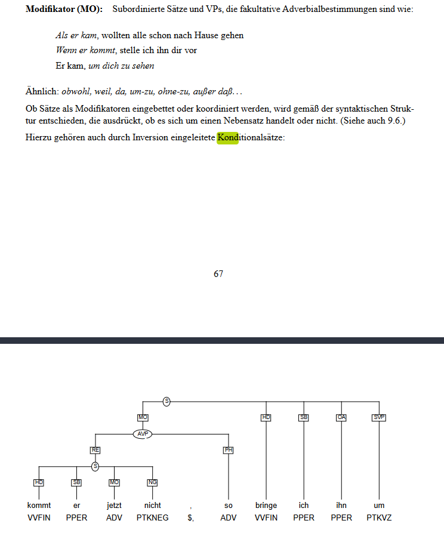
['(CS (S (VVFIN Kommt) (NP (ART der) (NN Replikationskomplex)) (PP (APPR an) (ART eine) (ADJA schadhafte) (NN DNA-Stelle))) ($, ,) (CS (S (VVFIN löst) (PPER er) (PRF sich)) (KON und) (S (VVFIN überspringt) (NP (ART den) (NN Schaden))) ($, ,) (VP (KOUI um) (PP (APPR an) (ADJA anderer) (NN Stelle)) (VVIZU fortzufahren)))) ($. .)']
### b1 ID:3

POS okay, beim Baum müsste nach TIGER schema der Relativesatz Repiklationlücke untergeordente sein
['(S (PPER Es) (VVFIN entsteht) (NP (NP(ART eine) (NN Replikationslücke)) (PP (APPRART im) (NN Tochterstrang)) ($, ,) (S (PRELS die) (VP (NP (AP (ADV über) (CARD 800)) (NN Basen)) (VVINF umfassen)) (VMFIN kann)))) ($. .)']

### b1 ID: 4
Pos correct, baum nicht
PP clause verschoben
['(CS (S (PP (APPR Bei) (ART der) ($LRB ") (ADJA rekombinatorischen) (NN Reparatur) ($LRB ")) (VVFIN bindet) (NP (ART das) (NN RecA-Protein)) (PP (APPR an) (ART die) (NN Einzelstrang-DNA-Enden) (PP (CAVP (ADV links) (KON und) (ADV rechts)) (NP (ART der) (NN Replikationslücke))))) (KON und) (S (VVFIN sucht) (CNP (NP (ART die) (NN Schwesterchromatide)) (KON oder) (NP (ART das) (ADJA homologe) (NN Chromosom))) (PP (APPR nach) (ADJA homologen) (NN Sequenzen)) (PTKVZ ab))) ($. .)']

### b1 ID: 5
POS okay, baum versteckter Konditional satz APV einfügen?
Und einecoodination von mehreren Sätzen mit Label CS verschoben
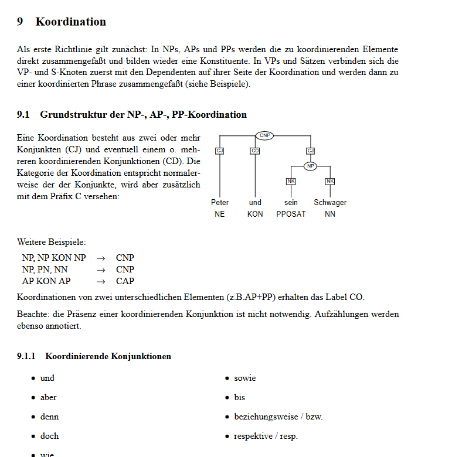
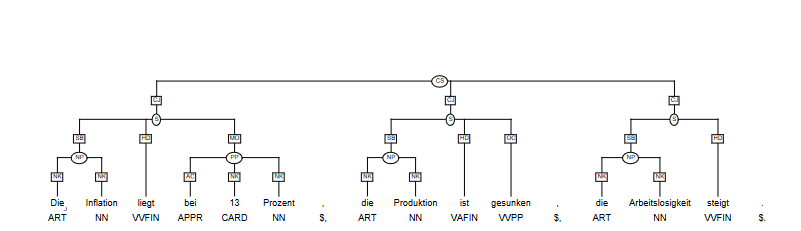
['(CS (S (VAFIN Ist) (NP (ART eine) (PIAT solche) (NN Stelle)) (VVPP gefunden)) ($, ,) (CS (S (VVFIN dringt) (NP (ART der) (NN Komplex)) (PP (APPR in) (ART die) (NN Doppelhelix)) (PTKVZ ein)) ($, ,) (S (VVFIN verdrängt) (NP (ART den) (ADJA homologen))) (KON und) (S (VVFIN bindet) (NP (ART den) (ADJA komplementären) (NN Strang))))) ($. .)']

### b1 ID: 6
als VOn APPR zu KOKOM? , sonst Pos richtig, Baum scheinnt okay
### b1 ID: 7

Pos correct, baum nicht? warum hat es eine PP clause? herausgelöscht
['(S (NP (ART Der) (ADJA verdrängte) (NN Strang)) (VVFIN paart) (PRF sich) (PP (APPR mit) (ART dem) (NN Strang) ($, ,) (S (PRELS der) (NP (ART den) (NN DNA-Schaden)) (VVFIN aufweist)))) ($. .)']
### b1 ID: 8
Pos correct , baum auch
### b1 ID: 9

POs correct, Baum nicht , VP scope verkleinert
['(S (VZ (PTKZU Zu) (VVINF beachten)) (VAFIN ist)) ($, ,) (CC (S (KOUS dass) (NP (ART der) (ADJA ursprüngliche) (NN DNA-Schaden))  (PP (APPR bei) (PDAT dieser) (NN Reparatur)) (VP (PTKNEG nicht) (VVPP behoben)) (VAFIN wird)) ($, ,) (KON sondern) (NP (ADV nur) (ART die) (NN Lücke) (PP (APPRART im) (NN Tochterstrang)))) ($. .)']
### b1 ID: 10
Pos correct, baum auch

### b2 ID: 1
POS correct, baum auch
['(CS (S (NN Wurzeln) (VVFIN entziehen) (NP (ART dem) (NN Boden)) (NN Wasser)) ($, ,) (KON aber) (S (PPER sie) (VVFIN nehmen) (ADV auch) (ADJA essenzielle) (NN Mineralstoffe) (PTKVZ auf))) ($. .)']

### b2 ID: 2

['(CS (S (NN Böden) (VAFIN sind) (ADJD heterogen)) (KON und) (S (VVFIN weisen) (NN Unterschiede) (PP (APPR auf) (ADJA kleinem) (NN Raum)) (PTKVZ auf))) ($. .)']
### b2 ID: 3
!!!
POS correct baum hat relative satz der falsch scheint
nicht klar wie ich kreuzende kanten einfügen soll, PP durch Np ersetzt und VP untergeordnet
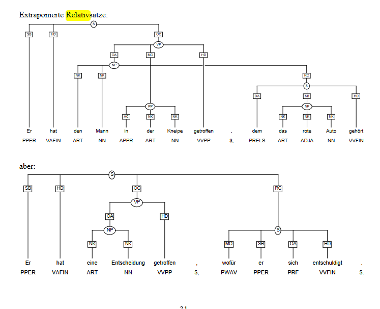

['(S (NP (NN Wurzeln) ($, ,) (S (PRELS die) (PP (APPR durch) (ART den) (NN Boden)) (VVFIN wachsen))) ($, ,) (VMFIN können) (VP (PP (APPR auf) (NP (NN Regionen) (VVINF treffen) ($, ,) (S (PRELS die) (PRF sich) (PP (APPRART im) (CNP (TRUNC Wasser-) (KON und) (NN Mineralstoffgehalt))) (VVFIN unterscheiden)))))) ($. .)']
### b2 ID: 4
verzweigt von VVPP zu ADJA, obwohl ich eher zu VVPP tendiere. als folge wird die VP als AP annotiert
['(S (PP (APPR In) (ART den) (AP (ADJD besser) (ADJA versorgten)) (NN Regionen)) (VAFIN sind) (NN Wurzeln) (AP (ADV oft) (ADJD stark) (ADJA verzweigt))) ($. .)']
### b2 ID: 5
POS correct,bei baum zusätzliche CS 
['(CS (S (PP (APPR Für) (ART die) (NN Aufnahme) (NP (ADJA mineralischer) (NN Nährstoffe))) (VAFIN ist) (NP (ART die) (NN Wurzelarchitektur)) (PP (APPR von) (AP (ADV ganz) (ADJA besonderer)) (NN Bedeutung))) ($, ,) (CS (S (KOUS weil) (PRF sich) (NP (ADJA unterschiedliche) (NN Mineralstoffe)) (AP (ADV ganz) (ADJD verschieden)) (VVFIN verhalten)) (KON und) (S (VP (PP (APPR durch) (ADJA verschiedenartige) (NN Kräfte)) (PP (APPRART im) (NN Boden)) (VVPP gehalten)) (VAFIN werden))) ($. .))']

### b2 ID: 6
PO und Baum correct
### b2 ID: 7
!!
pos correct, baum nicht, VP scope verkleinert, eigentlich müsste sich der als Satz sich auf schneller beziehen
['(S (NP (AP (ADJD Stark) (ADJA transpirierende)) (NN Pflanzen)) (VMFIN können) (NN Nitrat) (VP (ADJD schneller) (PP (APPRART zur) (NN Wurzeloberfläche)) (VVINF transportieren) ($, ,) (S (KOKOM als) (PPER sie) (VP (PPER es) (PP (APPRART im) (NN Pflanzenkörper)) (VVINF anreichern)) (VMFIN können)))) ($. .)']
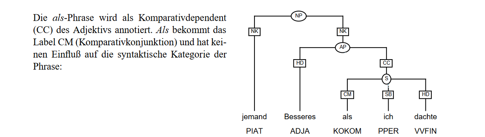
### b2 ID: 8
Pos correct, baum auch
['(CS (S (NP (ADJA Andere) (ADJA essenzielle) (NN Mineralstoffe) (NP (KOKOM wie) (NN Phosphat))) (VAFIN sind) (VP (ADV jedoch) (ADJD fest) (PP (APPRART im) (NN Boden)) (VVPP gebunden))) ($, ,) (S (PPER sie) (VAFIN haben) (NP (ADJA niedrige) (NN Diffusionskoeffizienten)))) ($. .)']

### b2 ID: 9

daher PAV statt PROAV, PP clause verschoben, satz hierarchy stimmt überhaupt nicht, versucht es zu verbessern
['(CS (S (NP (ART Die) (NN Phosphatverarmungszonen) (PP (APPR von) (CARD zwei) (NN Wurzeln)) ($, ,) (S (PRELS die) (AP (AP (ADV sehr) (ADJD nah)) (ADV beieinander)) (VAFIN sind))) ($, ,) (VVFIN überlappen) (PRF sich) (ADV kaum)) (KON und) (S (NP (ART ein) (AP (ADJD reich) (ADJA verzweigtes)) (NN Wurzelsystem)) (VVFIN erhöht) (NP (ART die) (NN Phosphataufnahme)) (PP (APPR bei) (ADJA knapper) (NN Phosphatversorgung)) (PROAV daher) (ADJD enorm))) ($. .)']
### b2 ID: 10
POS dagegenroav zu pav von P
['(S (NP (ART Ein) (AP (ADJD extensiv) (ADJA ausgebildetes)) (NN Wurzelsystem) (PP (APPR mit) (ADJA größeren) (NN Zwischenräumen))) (PROAV dagegen) (VMFIN kann) (VP (NP (ART die) (NN Nitrataufnahme)) (VVINF maximieren))) ($. .)']
### b3 ID: 1
Pos korrekt, baum nicht  
['(S (NN Motormoleküle) (VAFIN sind) (NP (NN Enzyme) ($, ,) (S (PRELS welche) (NP (ART die) (NN Energie) (PP (APPR aus) (ART der) (NN Hydrolyse) (PP (APPR von) (NN ATP)))) (PP (APPR in) (ADJA mechanische) (NN Energie)) (VVFIN umwandeln)))) ($. .)']

### b3 ID: 2

Dabei von Proav zu PAV, PP scope angepasst
['(S (PAV Dabei) (VVFIN induzieren) (PPER sie) (NP (ART eine) (NN Konformationsänderung) ($, ,) (S (PRELS die) (ART einen) (NN Transport) (PP (APPR auf) (NP (ART den) ($LRB ") (NN Gleisen))) ($LRB ") (VVFIN ermöglicht)))) ($. .)']
### b3 ID: 3
POS okay
['(S (NP (ART Die) ($LRB ") (NN Gleise)) ($LRB ") (VMFIN können) (VP (CNP (NN Mikrotubuli) (KON oder) (NN Aktinfilamente)) (VAINF sein))) ($. .)']
### b3 ID: 4
['(S (NP (ADJA Aktinbindende) (NN Motorproteine)) (VAFIN sind) (NP (ART die) (NN Myosine) ($, ,) (S (PP (APPR von) (PRELS denen)) (PP (APPR in) (NN Eukaryoten)) (NP (CARD siebzehn) (NN Familien)) (VVFIN vorkommen)))) ($. .)']
### b3 ID: 5
Pos okay, baum nicht, nicht möglich mit klammer notation 
['(S (NP (ART Eine) (ADJA schwere) (NN Kette)) (VAFIN ist) (VP (PP (APPR an) (NP (ART der) (NN Ausbildung)) (CNP (NP (ART einer) (TRUNC Schwanz-)) (KON und) (NP (ART einer) (NN Kopfregion) (VVPP beteiligt) ($, ,) (S (PRELS welche) (NP (ART die) (NN Motordomäne)) (VVFIN bildet))))))) ($. .)']
### b3 ID: 6
POS okay, baum auch
### b3 ID: 7

Pos okay, 
['(S (PP (APPRART Im) (NN Übergangsbereich) (PP (APPR von) (NN Kopf)) (PP (APPR zu) (NN Schwanz))) (VMFIN können) (CVP (VP (NP (CAP (ADJA unterschiedliche)  (ADJA leichte)) (NN Ketten)) (VVINF binden)) (KON und) (VP (PP (APPR auf) (PDAT diese) (NN Weise)) (PP (APPR an) (ART der) (NN Regulation) (PP (APPR von) (NN Myosin))) (VVINF mitwirken)))) ($. .)']

### b3 ID: 8
Pos okay, 
['(CS (S (PP (APPR In) (ART den) (AP (PTKNEG nicht) (ADJA muskulären)) (NN Zellen)) (ADV beispielsweise) (VVFIN registriert) (NP (ART eine) (NN Calmodulinkette)) (NP (ART die) (NN Anwesenheit) (PP (APPR von) (NN Calciumionen)))) (KON und) (S (VVFIN ermöglicht) (NP (ART die) (NN Bindung) (PP (APPR von) (NN Myosin)) (PP (APPR an) (NN Aktin))))) ($. .)']
### b3 ID: 9'

POS okay,
['(S (PP (ADV Je) (APPR nach) (NN Klasse)) (VMFIN kann) (NP (ART der) (NN Schwanz)) (VP (PP (APPR an) (NN Vesikel)) (VVINF anlagern)) ($, ,) (VP (KOUI um) (PPER sie) (PP (APPR entlang) (ART des) (NN Aktinfilaments)) (VZ (PTKZU zu) (VVINF ziehen)))) ($. .)']
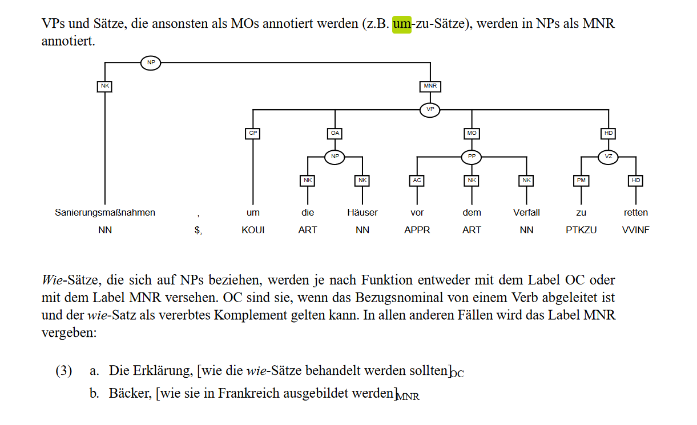

### b3 ID: 10
PIAt zu PIDAT geändert, baum okay
['(S (NP (PIAT Alle) (NN Myosine) (PP (APPR bis) (APPR auf) (NN Myosin) (CARD VI))) (VVFIN bewegen) (PRF sich) (PP (APPRART zum) (NP ($LRB +) (NN Ende)) (NP (ART des) (NN Aktinfilaments)))) ($. .)']
### b3 ID: 11

['(CS (S (NP (NN Myosin) (CARD II)) (VAFIN ist) (NP (ART ein) (NN Dimer))) ($, ,) (CS (S (PPER es) (VAFIN hat) (NP (CARD zwei) (NN Köpfe))) (KON und) (S (VMFIN kann) (VP (PP (APPR mit) (PPOSAT seinem) (NN Schwanz)) (PP (APPR an) (ART ein) (ADJA bipolares) (NN Filament)) (VVINF binden))))) ($. .)']
### b3 ID: 12
!!
['(CS (S (PPER Es) (VAFIN ist) (VP (PP (APPRART im) (ADJA kontraktilen) (NN Apparat) (NP (ART der) (NN Muskelzellen))) (VZ (PTKZU zu) (VVINF finden)))) ($, ,) (KON aber) (CP (ADV auch) (APPR in) (ADJA anderen) (NN Zellen) ($, ,) (S (PWAV wo) (PPER es) (VP (PP (APPRART am) (NN Kontraktionsmechanismus)) (VVPP beteiligt)) (VAFIN ist)))) ($. .)']
### b4 ID: 1
['(CS (S (NP (ART Eine) (ADJA chlorophyllhaltige) (NN Parenchymzelle) (PP (APPR in) (ART einem) (NN Angiospermenblatt))) (VVFIN exportiert) (NP (ADJA organisches) (NN Material)) (PP (APPR in) (NN Form) (PP (APPR von) (NN Saccharose))) (PP (APPR aus) (ART der) (NN Zelle))) (KON und) (S (VVFIN versorgt) (PROAV damit) (PP (ADV selbst) (APPR in) (ART der) (NN Nacht)) (NP (PIAT alle) (ADJA chlorophyllfreien) (NN Zellen) (NP (ART der) (NN Pflanze))))) ($. .)']
korrekt

### b4 ID: 2 und 3 & 4
gesplitteter satz?
['(S (NP (ART Das) (NN Prinzip)) (VAFIN ist) (ADJD einfach)) ($. :)'] ['(S (PP (APPRART Am) (NN Tag)) (VVFIN speichert) (NP (ART der) (NN Chloroplast)) (NP (ART die) (CAP (ADJA gebildete) (KON und) (ADJA überschüssige)) (NN Glucose) (PP (APPR aus) (ART der) (NN Photosynthese))) (PP (APPR als) (NN Stärke))) ($. ;)'] ['(S (PP (APPR in) (ART der) (NN Nacht)) (VVFIN kommt) (PPER es) (PP (APPR zu) (ART einer) (NN Stoffentnahme)) (PP (APPR aus) (PDAT diesem) (NN Speicher)))) ($. .)']
hier ist **als** doch kein kokom sondern APPR, falsch in stimuli
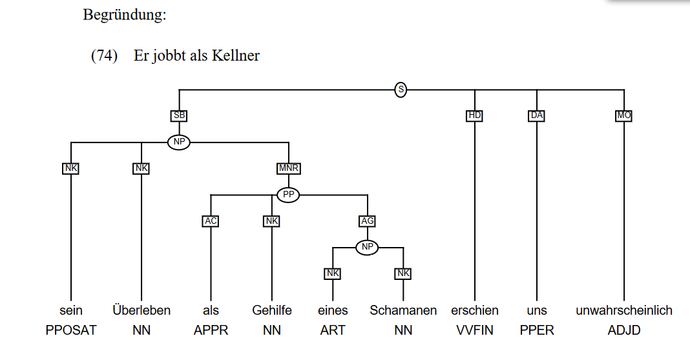
kommt es explletives es 
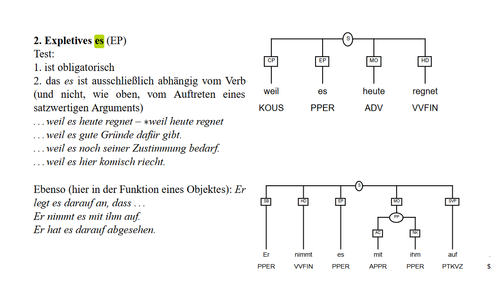
['(CS (S (NP (ART Das) (NN Prinzip)) (VAFIN ist) (ADJD einfach)) ($. :)'(S (PP (APPRART Am) (NN Tag)) (VVFIN speichert) (NP (ART der) (NN Chloroplast)) (NP (ART die) (CAP (ADJA gebildete) (KON und) (ADJA überschüssige)) (NN Glucose) (PP (APPR aus) (ART der) (NN Photosynthese))) (PP (APPR als) (NN Stärke))) ($. ;) (S (PP (APPR in) (ART der) (NN Nacht)) (VVFIN kommt) (PPER es) (PP (APPR zu) (ART einer) (NN Stoffentnahme)) (PP (APPR aus) (PDAT diesem) (NN Speicher)))) ($. .)']

### b4 ID: 5
['(S (NP (ART Die) (NN Zelle)) (VMFIN kann) (PP (APPR auf) (PDAT diese) (NN Weise)) (CNP (NN Tag) (KON und) (NN Nacht)) (VP (NP (ART einen) (NN Export)) (VVINF gewährleisten))) ($. .)']

### b4 ID: 6
!!!
['(CS (CS (S (NN Saccharose) (VAFIN ist) (NP (ART ein) (NN Dimer))) (KON und) (S (VVFIN wirkt) (PTKNEG nicht) (ADJD reduzierend))) ($, ,) (S (PPER sie) (VAFIN wird) (PP (APPR in) (ART der) (NN Pflanze)) (VP (PP (APPR vor) (PIS allem)) (PP (APPR als) (AP (ADJD leicht) (ADJA verfügbarer)) (NN Speicherstoff)) (VVPP verwendet)))) ($. .)']
hier ist als doch wieder APPR und nicht kokom
 
### b4 ID: 7
['(CS (S (NN Stärke) (VAFIN ist) (NP (ART ein) (ADJA großes) (NN Polymer) (PP (APPR aus) (NN Glucose)))) ($, ,) (S (VVFIN wirkt) (ADV ebenfalls) (PTKNEG nicht) (ADJD reduzierend)) (KON und) (S (VAFIN ist) (VP (PP (ADJD hauptsächlich) (APPR in) (NN Speicherorganen)) (VZ (PTKZU zu) (VVINF finden))))) ($. .)']
hauptsächlich

### b4 ID: 8
POs okay, baum scheint auch okay
['(S (NP (ART Das) (AP (AA (PTKA am) (ADJD häufigsten)) (PP (APPR in) (ART der) (NN Biosphäre)) (ADJA vorkommende)) (NN Kohlenhydrat)) (VAFIN ist) (ADJD unbestritten) (NP (ART die) (NN Cellulose))) ($. .)']
### b4 ID: 9
hauptsächlich wieder einmal ADJD vs ADV
['(CS (S (PPER Sie) (VAFIN ist) (NP (ART ein) (ADJA lineares) (NN Polymer) (PP (APPR aus) (NN β-D-Glucose)))) (KON und) (S (VVFIN liegt) (AP (ADJD hauptsächlich) (ADJD extrazellulär)) (PTKVZ vor))) ($. .)']

### b4 ID: 10
POs , baum angepasst wieder Relativesätze die nicht verschachtelt geklammert werden können
['(CS (S (NP (PDAT Dieses) (NN Molekül)) (VAFIN wird) (VP (APPR durch) (ADJA membranständige) (NN Cellulose-Synthasekomplexe) (VVPP synthetisiert))) ($, ,) (CS (S (PRELS die) (PP (APPR in) (ART der) (NN Membran)) (VVFIN zirkulieren)) (KON und) (CS (S (PP (APPR in) (ADJA gewisser) (NN Weise)) (ART die) (NN Cellulose-Mikrofibrillen) ($LRB ") (VVFIN weben) ($LRB ")) ($, ,) (S (PRELS die) (NP (ART die) (ADJA extrazelluläre) (NN Matrix) (NP (ART der) (NN Pflanzenzellen))) (VVFIN ausmachen))))) ($. .)']
### b5 ID: 1
Pos correct
!!
['(S (NP (ART Ein) (NN Prion)) (VAFIN ist) (NP (ART ein) (ADJA infektiöses) (NN Protein) ($, ,) (S (PRELS das) (PP (APPR von) (ART einem) (CAP (ADJA endogenen) ($, ,) (ADJA zellulären)) (NN Protein)) (VVFIN abstammt)) (KON und) (S (NP (PRELAT dessen) (NN Primärstruktur)) (VVFIN besitzt))) ($, ,) (S (PRF sich) (ADV aber) (PP (APPR in) (CNP (TRUNC Sekundär-))) ($, ,) (S (TRUNC Tertiär-) (KON und) (NN Quartärstrukturen) (PP (APPR von) (PDS diesem)) (VVFIN unterscheidet)))) ($. .)']
### b5 ID: 2
pos correct
['(S (NP (PPOSAT Seine) (ADJA strukturellen) (NN Eigenschaften)) (VVFIN verleihen) (NP (ART dem) (NN Prion)) (NP (ART die) (NN Fähigkeit))) ($, ,) (VP (PRF sich) (PP (APPR durch) (NN Autokatalyse)) (PP (APPR von) (ART einem) (NN Wildtypprotein)) (PP (APPRART zum) (NN Prionenprotein)) (VVIZU umzuwandeln)) ($. .)']
### b5 ID: 3
pos correct
['(S (NP (PDAT Dieses) (NN Ereignis)) (VMFIN kann) (VP (CO (ADJD spontan) (KON oder) (PP (APPR durch) (ART die) (NN Aufnahme) (NP (ART eines) (ADJA anderen) (NN Prions)))) (VVINF erfolgen))) ($. .)']

### b5 ID: 4
pos correct, baum auch 
### b5 ID: 5
pos correct, Bin das nur ich oder macht dieser Satz gar kein Sinn? die Relativsätze bezeichnen alle Eigenschaften die **Proteinaggregate** haben müssen um ein Amyloid zu sein, oder? Aber dann sollten alle RS verben im plural sein  
Wikipedia: 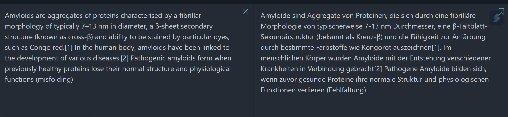 
Aber dan müsste der Satz doch folgendermassen heisen: 

Der Begriff Amyloid ist allgemein gehalten und umfasst Proteinaggregate, die auf eine besondere physikalisch-chemische Weise angeordnet sind, in der ** oder in denen**? (bezieht sich das auf Weise oder Proteinaggregate?) eine Fadenform **mit** zum Großteil β-Faltblattstrukturen zu finden sind und in der (oder in ** welchen** ?) eine Doppelbrechung von polarisiertem Licht nach Färbung mit Kongorot auftritt.
!!!

['(CS (S (NP (ART Der) (NN Begriff) (NN Amyloid)) (VAFIN ist) (VP (ADJD allgemein) (VVPP gehalten))) (KON und) (CS (S (VVFIN umfasst) (NP (NN Proteinaggregate) ($, ,) (S (PRELS die) (VP (PP (APPR auf) (ART eine) (ADJA besondere) (ADJA physikalisch-chemische) (NN Weise)) (VVPP angeordnet)) (VAFIN sind))))) ($. :) (S (NP (ART eine) (NN Fadenform)) ($, ,) (CS (S (PP (APPR in) (PRELS der)) (PP (APPRART zum) (NN Großteil)) (NN β-Faltblattstrukturen) (VP (VZ (PTKZU zu) (VVINF finden))) (VAFIN sind)) (KON und) (S (PP (APPR in) (PRELS der)) (NP (ART eine) (NN Doppelbrechung) (PP (APPR von) (ADJA polarisiertem) (NN Licht))) (PP (APPR nach) (NN Färbung)) (PP (APPR mit) (NN Kongorot)) (VVFIN auftritt))))) ($. .)']
### b5 ID: 6
pos correct
['(CS (S (NP (ART Das) (NN Prion)) (VVFIN bringt) (NP (PIAT keine) (ADJA genetische) (NN Veränderung)) (PP (APPR mit) (PRF sich))) ($, ,) (KON denn) (S (NP (ART das) (ADJA verantwortliche) (NN Gen)) (VVFIN führt) (ADV weiterhin) (PP (APPRART zur) (NN Expression) (PP (APPR von) (NN Proteinen) (PP (APPR mit) (ADJA normaler) (NN Primärstruktur)))))) ($. .)']
### b5 ID: 7
pos correct, baum auch
### b5 ID: 8
pos correct
['(S (NP (ART Eine) (NN Deletion) (NP (ART des) (ADJA codierenden) (NN Gens) (NP (ART des) (ADJA zellulären) (NN Proteins)))) (VAFIN würde) (ADV somit) (VP (NP (ART eine) (NN Prioneninfektion)) (VVINF verhindern))) ($. .)']

### p0 ID: 1
!!!
Pos correct
['(S (NP (ART Ein) (NN Zyklotron)) (VVFIN besteht) (PP (APPR aus) (ART einer) (CAP (ADJA flachen) ($, ,) (ADJA zylindrischen)) (NN Vakuumkammer)) (PP (APPR zwischen) (ART den) (NN Polen) (NP (ART eines) (NN Elektromagneten) ($, ,) (S (PRELS der) (NP (ART ein) (NN Feld) (PP (APPR in) (NN z-Richtung))) (VVFIN erzeugt))))) ($. .)']
### p0 ID: 2
!!!
Pos correct
['(S (NP (ART Die) (NN Kammer)) (VAFIN ist) (VP (PP (APPR in) (CARD zwei) (ADJA D-förmige) (NN Hälften) (VVPP aufgeteilt) ($, ,) (S (PP (APPR zwischen) (PRELS denen)) (NP (ART eine) (NN Hochfrequenzspannung)) (VVFIN anliegt))))) ($. .)']
### p0 ID: 3
!!!
Zu von PRKZU zu APZR geändert
['(S (NP (ART Die) (AP (APPR von) (ART der) (NN Ionenquelle) (PP (APPRART im) (NN Spalt) (PP (APPR zwischen) (ART den) (NN Kammern))) (PP (APPRART im) (NN Zentrum) (NP (ART der) (NN Anordnung))) (ADJA emittierten)) (ADJA positiven) (NN Ionen)) (VAFIN werden) (VP (PP (APPR auf) (ART die) (ADJA negative) (NN Kammerhälfte)) (VZ (APZR zu) (VVINF beschleunigt)))) ($. .)']
Baum übersprungen nochmals kontrollieren

### p0 ID: 4
!!!
Pos correct? wieder ein als das ich als APPR annotieren würde nicht als KOKOM
['(CS (S (KOUS Da) (PP (APPRART im) (NN Inneren) (NP (ART der) (NN Kammerhälften) (PP (APPR mit) (ADJA metallischen) (NN Wänden)))) (NP (PIAT kein) (ADJA elektrisches) (NN Feld)) (VVFIN existiert)) ($, ,) (S (VVFIN beschreiben) (NP (ART die) (NN Ionen)) (ADV hier) (PP (APPRART im) (NN Magnetfeld)) (NP (ART einen) (NN Halbkreis) (PP (APPR in) (ART der) (NN x-y-Ebene))) ($, ,) (S (NP (PRELAT dessen) (NN Radius)) (CC (VP (PP (APPR durch) (ART die) (AP (PP (APPR als) (NN Zentripetalkraft)) (ADJA wirkende)) (NN Lorentzkraft)) (VVPP festgelegt)) (KON und) (S (NP (PRELAT dessen) (NN Umlaufszeit)) (AP (ADJD unabhängig) (PP (APPRART vom) (NN Radius))) (VAFIN ist)))))) ($. .)']
### p0 ID: 5
Pos deshalb PROAV oder PAV
['(CS (S (VAFIN Wird) (NP (ART die) (NN Hochfrequenz)) (ADV nun) (VP (AVP (ADJD genau) (ADV so)) (VVPP gewählt))) ($, ,) (S (KOUS dass) (NP (ART die) (NN Ionen)) (PP (APPR nach) (NN Durchlaufen) (NP (ART des) (NN Halbkreises))) (PP (ADV immer) (APPR zu) (ART einem) (NN Zeitpunkt) (ADV wieder)) (PP (APPRART am) (NN Spalt) (VVFIN ankommen) ($, ,) (S (PP (APPR bei) (PRELS dem)) (NP (ART die) (ADJA richtige) (NN Polarität) (NP (ART der) (NN Beschleunigungsspannung))) (VVFIN anliegt))) ($, ,) (CS (S (VVFIN nimmt) (NP (PPOSAT ihre) (ADJA kinetische) (NN Energie)) (PP (APPR bei) (NN Durchlaufen) (NP (ART des) (NN Spaltes))) (PTKVZ zu)) ($, ,) (CS (S (NP (PPOSAT ihre) (NN Geschwindigkeit)) (VVFIN wächst)) (KON und) (NP (PROAV daher) (ADV auch) (ART der) (NN Radius) (NP (ART des) (ADJA nächsten) (NN Halbkreises))))))) ($. .)']
### p0 ID: 6
deshalb RROAV PAV
['(CS (S (NP (ART Die) (NN Ionen)) (VVFIN durchlaufen) (PROAV deshalb) (NP (ART eine) (ADJA spiralartige) (NN Bahn) ($, ,) (S (PRELS die) (PP (APPR aus) (PIAT lauter) (NN Halbkreisen)) (PP (APPR mit) (ADJA wachsenden) (NN Radien)) (VVFIN besteht)))) ($, ,) (CS (S (KOUS bis) (PPER sie) (VP (NP (ART den) (NN Rand) (NP (ART des) (NN Magnetfeldes))) (VVPP erreicht)) (VAFIN haben)) (KON und) (S (VP (VP (ADV dort) (PP (APPR durch) (ART ein) (ADJA elektrisches) (NN Ablenkfeld)) (VVPP extrahiert)) (VAINF werden)) (VMFIN können)))) ($. .)']
### p1 ID: 1
Daher PROAV PAv
['(CS (S (AVP (S (KOUS Wenn) (NP (ART ein) (ADJA ruhendes) (NN Atom)) (NP (ART ein) (NN Photon)) (VVFIN absorbiert)) ($, ,)  (ADV so)) (VVFIN nimmt) (PPER es) (PP (APPR bei) (ART der) (NN Absorption)) (NP (ART den) (NN Photonenimpuls)) (PTKVZ auf)) (KON und) (S (VVFIN erfährt) (PROAV deshalb) (NP (ART einen) (NN Rückstoßimpuls) ($, ,) (S (PRELS der) (PP (APPR zu) (ART einer) (ADJA kinetischen) (NN Rückstoßenergie)) (VVFIN führt))))) ($. .)']
### p1 ID: 2
Fehler im Stimuli übertragen ist VVPP nicht VVFIN (passiv nicht futur)
['(S (NP (ART Die) (NN Photonenenergie)) (VAFIN wird) (VP (PROAV dabei) (CPP (PP (PP (APPRART zum) (PIS einen)) (APPR als) (NN Rückstoßenergie)) (KON und) (PP (PP (APPRART zum) (PIS anderen)) (APPR als) (NN Anregungsenergie))) (PP (APPR auf) (ART das) (NN Atom)) (VVPP übertragen))) ($. .)']
### p1 ID: 3
pos & Baum correct
### p1 ID: 4
pos & Baum correct
### p1 ID: 5
dessen PRELAt oder PDS -> PRELAT 
['(S (NP (ART Die) (AP (PROAV dabei) (ADJA erzeugte)) (NN Rückstoßenergie)) (VVFIN fehlt) (NP (ART dem) (ADJA emittierten) (NN Photon))) ($, ,) (S (ADV so) (KOUS dass) (NP (PRELAT dessen) (NN Wellenlänge)) (ADV ebenfalls) (AP (PP (APPR von) (PDS jener) (NP (ART der) (NN Anregung))) (ADJD verschieden)) (VAFIN ist)) ($. .)']

### p1 ID: 6
pos correct
['(NP (NN Atome) ($, ,) (S (PRELS die) (PRF sich) (PP (ADV nur) (APPR in) (PPOSAT ihrem) (NN Impuls)) (VVFIN unterscheiden))) ($, ,) (S (VMFIN können) (ADV also) (CVP (VP (NP (NN Photonen) (PP (APPR mit) (ADJA unterschiedlicher) (NN Frequenz))) (VVINF absorbieren)) (KON bzw.) (VP (VVINF emittieren)))) ($. .)']
### p1 ID: 7
CNP gelöscht und CS eingefügt, aber Konditional satz ist noch nicht richtig 
['(CS (S (VVFIN Befindet) (PRF sich) (NP (ART ein) (NN Atom)) (PP (APPR in) (ART einem) (NN Kristallgitter))) ($, ,) (CS (S (VVFIN überträgt) (PRF sich) (ART der) (NN Rückstoß) (PP (APPR auf) (PDS dieses))) (KON und) (S (NP (ART die) (NN Energie) (PP (APPR von) (CAP (ADJA absorbiertem) (KON und) (ADJA emittiertem)) (NN Photon))) (VVINF entsprechen) (NP (PP (APPR in) (ADV etwa)) (ART der) (NN Anregungsenergie))))) ($. .)']

### p1 ID: 8
POS benutz im stimuli falsch, ist ein VVPP kein VVFIN
['(S (PDS Dies) (VAFIN wird) (VP (PP (APPR in) (ART der) (NN Mößbauerspektroskopie)) (VVPP benutzt))) ($, ,) (VP (KOUI um) (PP (APPR mit) (NN Hilfe) (NP (ART der) (NN Dopplerverschiebung) (NP (ART der) (NN Emissionslinien)))) (NP (ADV etwa) (NN Hyperfeinstrukturenaufspaltungen)) (PP (APPR in) (ART einer) (NN Probe)) (VZ (PTKZU zu) (VVINF analysieren))) ($. .)']

### p2 ID: 1

['(S (NP (ADJA Photonische) (NN Kristalle)) (VAFIN sind) (NP (AP (ADJD räumlich) (ADJA periodische)) (NN Anordnungen) (PP (APPR von) (ADJA dielektrischen) (NN Medien)) (PP (APPR mit) (CNP (NP (ADJA unterschiedlicher) (NN Dielektrizitätskonstante)) (KON und) (NP (PROAV damit) (ADJA unterschiedlichen) (NN Brechzahlen)))))) ($. .)']

DAmit PROAV PAV ansosnten correct
### p2 ID: 2
die PRLES oder ART 
z.B. NN oder KON (beides nicht richtig?  )

['(S (PIS Man) (VMFIN kann) (VP (PPER sie) (VVINF realisieren)) (PP (APPR durch) (ADJA transparente) (NN Materialien)) ($, ,) (S (PP (APPR in) (PRELS die)) (NP (ADJA periodische) (NN Strukturen) ($LRB -LRB-) (PP (NN z.B.)) (ADJA dielektrische) (CNP (NN Mikrozylinder) (KON oder) (NN Kügelchen)) ($LRB -RRB-) (PP (S (VP (VVPP eingebaut)) (VAFIN sind))))) ($, ,) (S (NP (PRELAT deren) (NN Abstände)) (PP (APPR in) (ART der) (NN Größenordnung) (NP (ART der) (ADJA optischen) (NN Wellenlänge))) (VVFIN liegen))) ($. .)']

### p2 ID: 3
deshalb PROAV PAV ansonsten baum und POs correct

['(S (PPER Sie) (VVFIN beeinflussen) (PROAV deshalb) (NP (ART die) (NN Ausbreitung) (PP (APPR von) (NN Licht)) (PP (APPR in) (PDAT diesen) (NN Materialien)))) ($. .)']

### p2 ID: 4
POS okay, Baum bräuchte wieder kreuzende kannten
['(S (AVP (S (VVFIN Fällt) (NP (ART eine) (NN Lichtwelle)) (PP (APPR auf) (PDAT diese) (NN Struktur))) ($, ,)  (ADV so)) (VAFIN wird) (NP (ART ein) (NN Teil) (NP (ART der) (NN Wellenamplitude))) (VP (PP (APPR an) (ART den) (NN Grenzflächen) (NP (ART der) (ADJA periodischen) (NN Struktur))) (VVPP reflektiert))) ($. .)']

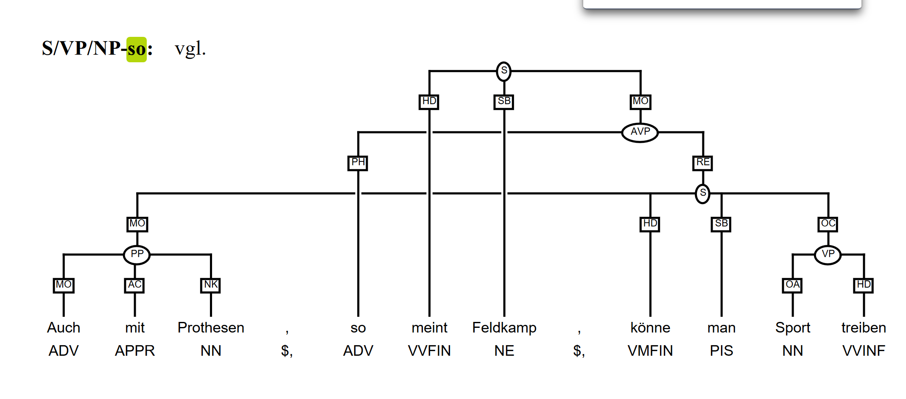

### p2 ID: 5
pi-vielfaches  von PIS zu NN geändert in ct
deshalb PAV Proav
['(S (S (VAFIN Ist) (NP (ART die) (NN Periode) (NP (ART der) (NN Struktur))) (NP (ART ein) (NN π-vielfaches) (NP (ART der) (NN Wellenlänge)))) ($, ,) (CS (S (VVFIN überlagern) (PRF sich) (NP (ART die) (ADJA reflektierten) (NN Anteile)) (ADJD phasenrichtig)) (KON und) (S (VVFIN addieren) (PRF sich) (PROAV deshalb)))) ($. .)']

### p2 ID: 6
POS und BAum correct

### p2 ID: 7
POS correct
['(S (S (VAFIN Ist) (NP (ART die) (NN Periode) (NP (ART der) (NN Struktur))) (NP (ART ein) (ADJD ungeradzahlig) (NN π-vielfaches) (NP (ART der) (ADJA halben) (NN Wellenlänge)))) ($, ,) (CS (S (VAFIN sind) (NP (ART die) (NN Phasen) (NP (ART der) (ADJA reflektierten) (NN Wellen))) (VP (ADV gegeneinander) (VVPP verschoben))) (KON und) (S (NP (ART die) (ADJA reflektierten) (NN Anteile)) (VVFIN löschen) (PRF sich) (CAVP (ADV teilweise) (KON oder) (ADV ganz)) (PTKVZ aus)))) ($. .)']

### p3 ID: 1
als KOKOM APPR falsch im Stimuli

['(S (NP (ART Der) (ADJA entscheidende) (NN Durchbruch) (PP (APPRART zur) (NN Aufstellung) (NP (ART eines) (NN Ordnungsschemas)))) (VVFIN gelang) (NP (ART dem) (NN Quarkmodell) ($, ,) (S (PRELS das) (ART die) (NN Vielzahl) (ART der) (AP (ADV bisher) (ADJA gefundenen)) ( PP (APPR als) ($LRB ")  (NN Elementarteilchen) ($LRB ") (NP (S (NP (NP (AP (ADJA angenommenen)) (NN Teilchen)))))) (PP (APPR als) (NN Systeme) (PP (APPR mit) (ADJA innerer) (NN Struktur) (VVFIN ansieht) ($, ,) (PRELS die) (VP (PP (APPR aus) (PIAT wenigen) ($LRB ") (AP (ADV noch) (ADJA elementareren)) ($LRB ") (NN Teilchen)) (VVPP zusammengesetzt)) (VAFIN sind))))))) ($. .)']

bröuchte wieder kreuzende kanten

### p3 ID: 2
als KOKOm zu APPR
benachbart zu ADJD
['(S (AVP (S (VVFIN Trägt) (PIS man) (NP (ART die) (AP (ADV bisher) (ADJA bekannten)) (NN Hadronen)) (PP (APPR in) (ART einem) (NN Diagramm) (PTKVZ ein) ($, ,)  (CS (S (PP (APPR in) (PRELS dem)) (NP (PPOSAT ihre) (NN Masse)) (PP (APPR als) (NN Ordinate))) (KON und) (S (NP (PPOSAT ihr) (NN Spin)) (VP (PP (APPR als) (NN Abszisse)) (VVPP gewählt)) (VAFIN wird)))))) ($, ,) (ADV so) (VVFIN fällt) (PTKVZ auf) ($, ,) (S (KOUS dass) (PPER es) (ADJA bestimmte) (NN Gruppen) (VVFIN gibt)) ($, ,) (NP (CS (S (PP (APPR in) (PRELS denen)) (NP (ART die) (NN Teilchen)) (VP (PP (APPR in) (PDAT diesem) (NN Diagramm)) (ADJD eng) (ADJD benachbart)) (VAFIN sind)))) ($, ,) (S (VVFIN d.h.) (CNP (NP (ADJA gleichen) (NN Spin)) ($, ,) (NP (ADJA gleiche) (NN Parität)) (KON und) (NP (AP (ADV fast) (ADJA gleiche)) (NN Masse))) (VAFIN haben))) ($. .)']

### p3 ID: 3
wenigen PIAT PIDAT 

['(S (PDS Dies) (VVFIN brachte) (CNP (PN (NE Murray) (NE Gell-Mann)) (KON und) (PN (NE George) (NE Zweig))) (AP (ADJD unabhängig) (ADV voneinander)) (PP (APPR auf) (ART die) (NN Idee) ($, ,) (S (KOUS dass) (NN Hadronen) (VP (VP (PP ((APPR aus) (PIAT wenigen) ($LRB ") (ADJA elementareren) ($LRB ") NN Teilchen)) (VVPP zusammengesetzt)) (VAINF sein)) (VMFIN sollten)))) ($. .)']

### p3 ID: 4
als KOKOM APPr
['(S (NP (PDAT Diese) (NN Idee)) (VAFIN wurde) (VP (VVPP unterstützt) (PP (APPR durch) (ART das) (ADJA anomale) (ADJA magnetische) (NN Moment) (NP (ART des) (NN Neutrons) ($, ,)  (S (PRELS das) (PP (APPR als) (ADJA neutrales) (NN Teilchen)) (ADV eigentlich) (VP (NP (PIAT kein) (ADJA magnetisches) (NN Moment)) (VAINF haben)) (VMFIN sollte)))) ($, ,) (S (APPR außer) (KOUS wenn) (PPER es) (VP (APPR aus) (ADJA geladenen) (NN Teilchen) (VVPP zusammengesetzt)) (VAFIN ist)) ($, ,) (PP (S (NP (PRELAT deren) (NN Ladungen)) (PRF sich) (PP (APPR zu) (CARD null)) (VVFIN kompensieren))) ($. .)']

wieder kreuzende kanten

### p3 ID: 5
Ausserdem PAV PROAV
beide viele PIAT PIDAT

['(S (PROAV Außerdem) (VAFIN wurde) (VP (PP (APPR bei) (ART der) (NN Streuung) (PP (APPR von) (ADJA hochenergetischen) (CNP (NN Elektronen) (KON und) (NN Protonen))) (PP (APPR an) (CNP (NN Protonen) (KON und) (NN Neutronen)))) (VVPP gefunden)) ($, ,) (S (KOUS dass) (NP (PIAT beide) (NN Nukleonen)) (NP (PIAT viele) (NN Anregungszustände)) (VAFIN haben))) ($. .)']

Sehr komischer Satz
Ausserdem wurde bei der Streuung von hochenergetischen Elektronen und Protonen an Protonen und Neutronen beobachtet? herausgefunden? gefunden, dass beide Nukleonen viele Anregungszustände haben.

### p3 ID: 6 & 7 sätze gesplittet
deshalb PAV PROAV
['(CS (S (PPER Sie) (VMFIN können) (PROAV deshalb) (PIAT keine) ($LRB ") (ADJA elementaren) ($LRB ") (VP (NP (NN Teilchen)) (VAINF sein))) ($, ,) (KON sondern) (S (VMFIN müssen) (VP (PP (APPR aus) ($LRB ") (AP (ADJD wirklich) (ADJA elementaren)) ($LRB ") (NN Teilchen) (VVINF bestehen))))) ($. .)']

### p4 ID: 1

['(S (NP (ART Das) (NN Ziel) (NP (ART der) (ADJA holografischen) (NN Interferometrie))) (VAFIN ist) (NP (PPER es) ($, ,) (NP (NN Veränderungen) (PP (APPR an) (NN Objekten)) (PP (APPR durch) (CNP (NN Belastungen) ($, ,)  (NP (ADJA thermische) (NN Ausdehnung)) ($, ,)  (NN Schwingungen) (ADV usw.))) (VP (CAP (ADJD qualitativ) (KON und) (ADJD quantitativ)) (VZ (PTKZU zu) (VVINF erfassen)))))) ($. .)']
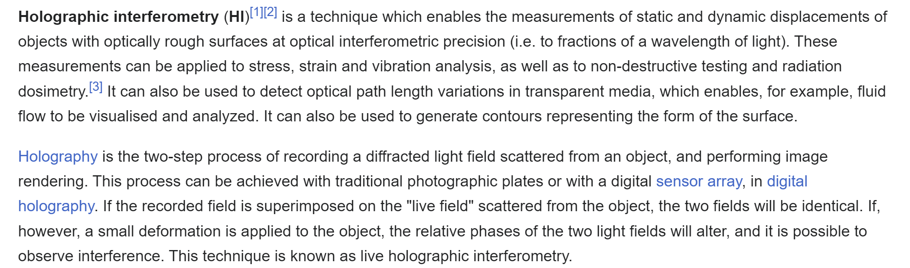
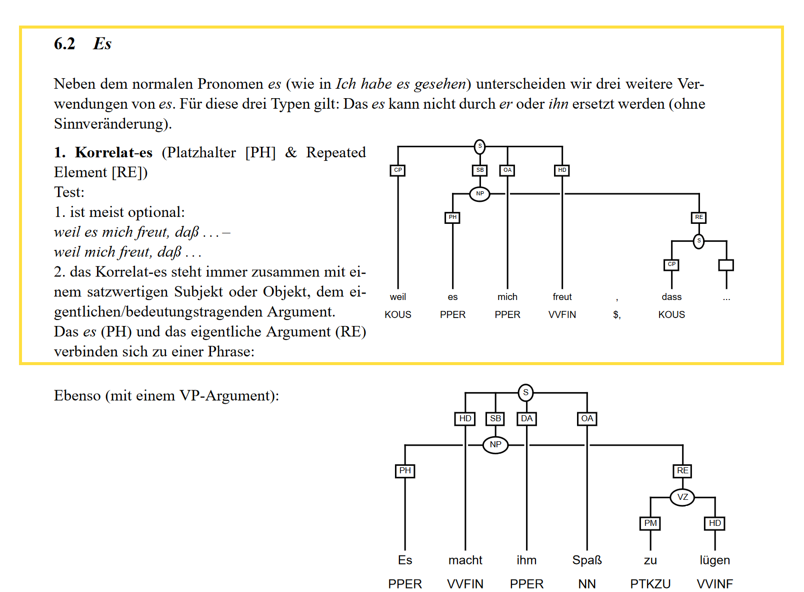

### p4 ID: 2
POS correct
['(S (PP (APPRART Beim) (NN Echtzeitverfahren) (NP (ART der) (ADJA holografischen) (NN Interferometrie))) (VAFIN wird) (PP (APPR von) (ART einem) (NN Objekt)) (PP (APPR in) (NN Ruhe)) (NP (ART ein) (NN Hologramm)) (VP (VVPP aufgenommen))) ($. .)']

### p4 ID: 3
POS correct
['(S (NP (ART Die) (NN Hologrammplatte)) (VAFIN wird) (ADV dann) ($, ,) (VP (KOUI ohne) (PPER sie) (VZ (PTKZU zu) (VVINF bewegen))) ($, ,) (CVP (VP (PP (APPRART am) (ADJA festen) (NN Ort) (NP (ART der) (NN Aufnahme))) (VVPP entwickelt)) (KON und) (VP (PP (APPR mit) (ART der) (NN Referenzwelle)) (VVPP beleuchtet)) ($, ,) (S (KOUS sodass) (NP (ART ein) (NN Hologrammbild)) (VVPP erzeugt) (VAFIN wird)))) ($. .)']

### p4 ID: 4
POS correct
wieder kreuzende kanten

['(S (CS (AVP (S (S (VVFIN Nimmt) (PIS man) (PP (APPRART am) (NN Objekt)) (NP (AP (ADV nur) (ADV sehr) (ADJA kleine)) (NN Änderungen)) (PTKVZ vor)) (KON und) (S (VVFIN beleuchtet) (PPER es) (PP (APPRART am) (ADJA gleichen) (NN Ort)) ( PP (ADV wieder) (ADJD genau) (PP (KOKOM wie) (APPR bei) (ART der) (ADJA ersten) (NN Aufnahme))))))) ($, ,) (S (ADV so) (VAFIN werden) (PRF sich) (NP (PDAT diese) (NN Änderungen)) (VP (PP (APPR in) (NN Phasenverschiebungen) (NP (ART der) (NN Signalwelle))) (VVINF äußern)))) ($. .)']

### p4  ID: 5   
POS correct

['(S (NP (ART Die) (NN Überlagerung) (NP (PDAT dieser) (NN Signalwelle)) (PP (APPRART vom) (ADJA veränderten) (NN Objekt)) (PP (APPR mit) (ART der) (NN Rekonstruktionswelle) (PP (APPRART vom) (NN Hologramm) (NP (ART des) (ADJA unveränderten) (NN Objektes))))) (VVFIN führt) ( PP (APPR zu) (NN Interferenzstrukturen)) (PP (APPRART im) (ADJA holografischen) (NN Bild) ($, ,)  (S (PRELS die) (ADV nur) (PP (APPR für) (PDAT diejenigen) (NN Teile) (NP (ART des) (NN Objektes)) (VVFIN auftreten) ($, ,)  (S (PRELS die) (VP (PRF sich) (VVPP verändert)) (VAFIN haben)))))) ($. .)']

### p4 ID: 6
POS correct

['(S (PP (APPR Auf) (PDAT diese) (NN Weise)) (VMFIN kann) (PIS man) (VP (NP (NN Gestaltsänderungen) (VVINF feststellen) ($, ,)  (S (PRELS die) (AP (ADJD wesentlich) (ADJD kleiner) (NP (KOKOM als) (ART eine) (NN Wellenlänge) (NP (ART des) (ADJA beleuchtenden) (NN Lichtes)))) (VAFIN sind))))) ($. .)']

### p5 ID: 1
POS correct

['(CS (S (PP (APPR Durch) (NN Einführen) (NP (ART der) (ADJA effektiven) (NN Masse))) (VMFIN können) (CNP (NP (NN Elektronen) (PP (APPRART im) (NN Leitungsband))) (KON und) (NP (NN Löcher) (PP (APPRART im) (NN Valenzband) (NP (ART eines) (NN Kristalles))))) (VP (VP (NP (KOKOM wie) (ADJA freie) (NN Teilchen)) (VVPP aufgefasst)) (VAINF werden))) (KON und) (S (VVFIN bewegen) (PRF sich) (CPP (PP (APPRART am) (NN Energieminimum) (PP (APPRART im) (NN Leitungsband))) (KON und) (PP (APPRART am) (NN Energiemaximum) (PP (APPRART im) (NN Valenzband)))) (PP (APPR auf) (NN Parabeln))))) ($. .)']

### p5 ID: 2

POS correct

['(S (S (KOUS Da) (NP (ART die) (ADJA effektive) (NN Masse) (PP (APPRART im) (ADJA oberen) (NN Teil) (NP (ART des) (NN Valenzbandes)))) (ADJD negativ) (VAFIN ist)) ($, ,) (VAFIN wird) (NP (ART die) (NN Energieparabel) (NP (ART der) (NN Löcher))) (VP (PP (APPR nach) (ADV unten)) (VVPP gekrümmt))) ($. .)']

### p5 ID: 3
POS Daraus PROAV
Baum sieht gut aus

### p5 ID: 4
POS correct
wieder komischer satz scheint aber richtig zu sein :
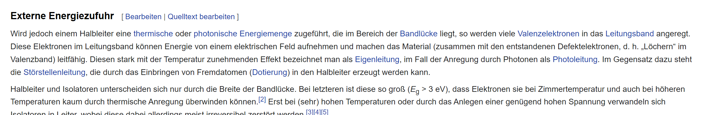
Baum sieht richtig aus 

### p5 ID: 5
solchen PIAT PIDAT
dabei PROAV PAV
['(S (S (KOUS Weil) (NP (ART der) (NN Wellenvektor) (NP (ART des) (NN Photons))) (AP (ADV sehr) (ADJD klein)) (VAFIN ist)) ($, ,) (VAFIN wird) (NP (ART die) (NN Wahrscheinlichkeit) (PP (APPR für) (ART einen) (PIAT solchen) (NN Übergang))) (AP (ADV viel) (ADJD größer)) ($, ,) (S (KOUS wenn) (NP (ART der) (NN Wellenvektor) (NP (ART des) (NN Elektrons))) (VP (PROAV dabei) (VVPP erhalten)) (VVFIN bleibt)) ($, ,) (S (KOKOM als) (KOUS wenn) (PP (APPR wegen) (ART der) (NN Impulserhaltung) (PP (APPRART beim) (NN Übergang))) (ADJD zusätzlich) (NP (ART ein) (NN Phonon)) (VP (VP (VVPP angeregt)) (VAINF werden)) (VMFIN muss))) ($. .)']

### p5 ID: 6
POS correct
['(S (AVP (S (VVFIN Liegt) (NP (ART das) (NN Minimum) (NP (ART der) (NN Elektronenparabel))) (PP (APPRART im) (NN Valenzband)) (PP (ADJD senkrecht) (APPR über) (ART dem) (NN Maximum) (NP (ART der) (NN Löcherparabel))))) ($, ,)  (ADV so) (VAFIN sind) (NP (ADJA senkrechte) (NN Übergänge)) (PP (ADV bereits) (APPR ab) (NN Photonenenergien) (PP (APPR in) (ART der) (NN Größe) (NP (ART der) (NN Bandlücke)))) (ADJD möglich)) ($. .)']

### p5 ID 7
Pos correct
['(CS (S (AVP (S (VAFIN Sind) (NP (ART die) (NN Extrema)) (VP (ADV gegeneinander) (VVPP verschoben))) ($, ,) (ADV so)) (VAFIN sind) (NP (ADJA direkte) (NN Übergänge)) (PP (ADV nur) (APPR bei) (ADJA höheren) (NN Photonenenergien)) (ADJD möglich)) (KON und) (S (NP (ADJA indirekte) (NN Übergänge) (PP (APPR mit) (AP (ADJD wesentlich) (ADJA kleinerer)) (NN Absorptionswahrscheinlichkeit))) (VAFIN sind) (NP (ART die) (ADJA einzige) (NN Möglichkeit) (PP (APPR für) (NN Photonenabsorption))))) ($. .)']

überkreuzende kanten

## Unterschiede in der Annotation stammen teilweise davon, dass im consticency_tree_file nach TIGER annotiert ist, und diese bei den folgenden TAGS vom STTS abweicht:
TIGER   STTS    
PIAT    PIAT/PIDAT
PROAV   PAV

Es macht meiner Meinung nach keinen Sinn die POS im consticuency tree den STTS tags anzupassen, wenn ihr dem TIGER Schema folgen wollt, 
Ich würde eher die POS tags col umbenennen im word feature file und dort anpassen, oder eine weitere col einfügen mit den TIGER tags. Oder sonst irgednwie darauf verweisen
